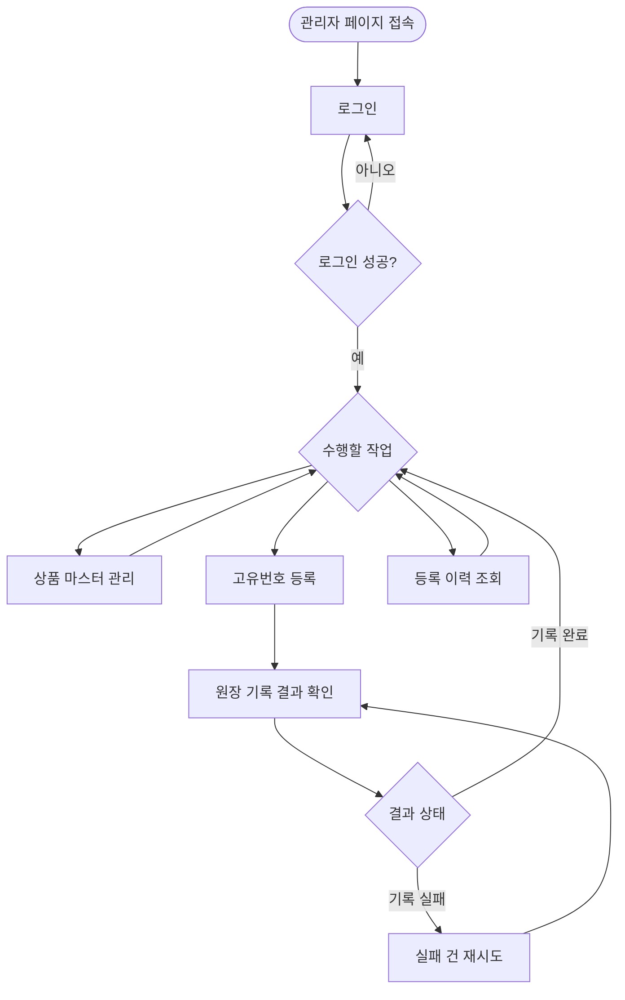
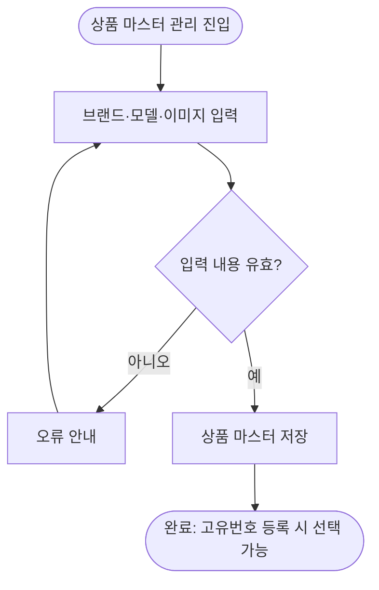
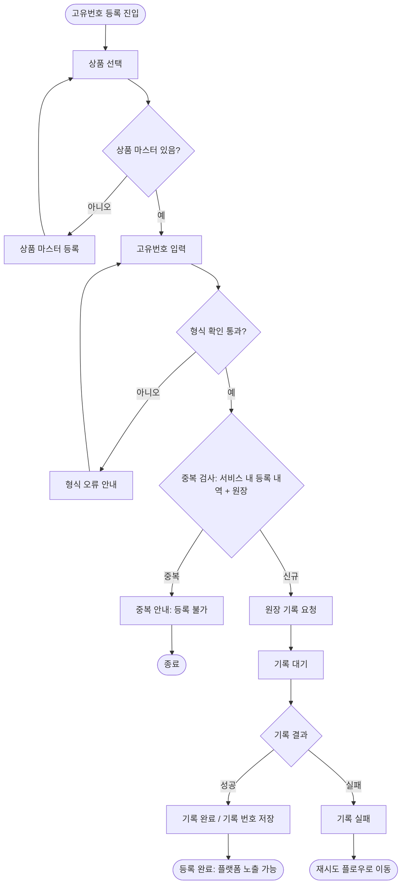
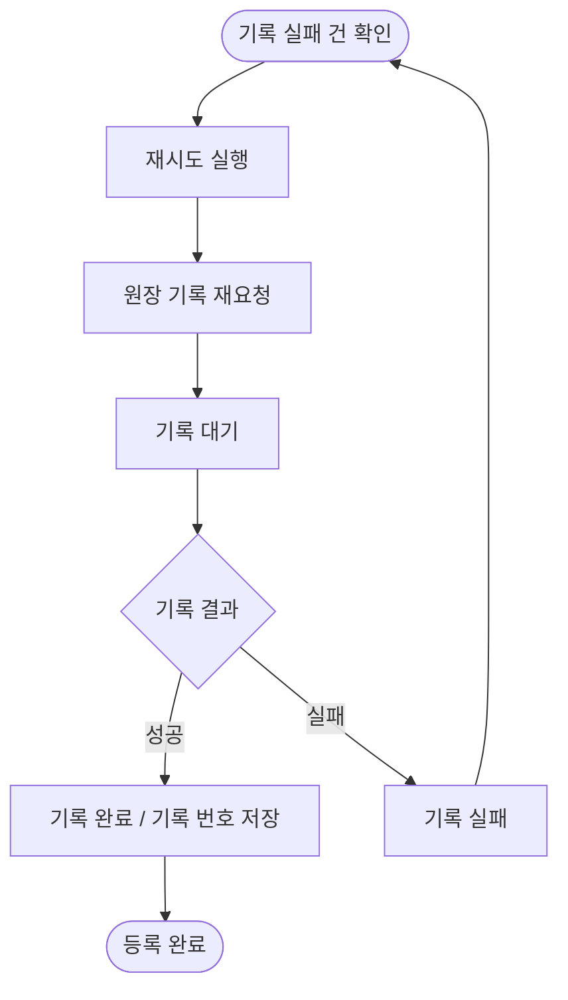
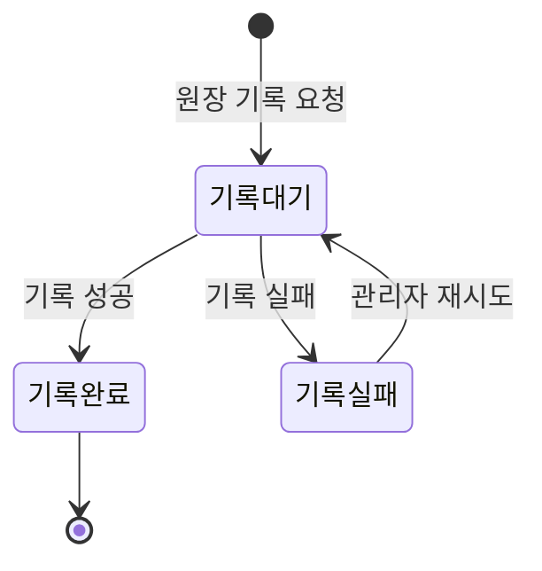
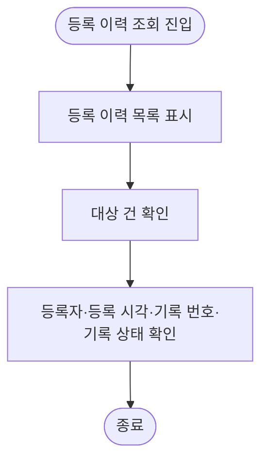

# 관리자 유저 플로우 (ACTOR-001)

`02-유저시나리오.md`의 흐름을 분기와 상태 중심으로 표현한 플로우다. 유저 스토리를 도출하는 근거 자료이며 별도 ID는 부여하지 않는다(ID 스키마 §13). 용어(원장, 기록 번호, 기록 대기·기록 완료·기록 실패 등)는 `규칙/03-용어집.md`를 따른다.

## 1. 전체 플로우

| 구분 | 설명 |
| --- | --- |
| 진입 조건 | 운영 측에서 미리 만들어 준 관리자 계정 |
| 분기 | 로그인 성공 여부, 수행할 작업 선택, 원장 기록 결과 |
| 반복 | 고유번호 등록 → 기록 결과 확인은 번호마다 반복된다 |

## 2. 상품 마스터 관리 플로우

| 단계 | 관리자 행동 | 시스템 처리 |
| --- | --- | --- |
| 1 | 브랜드, 모델, 이미지를 입력한다 | 필수 입력 여부 등 입력 내용을 확인한다 |
| 2 | 저장한다 | 상품 마스터를 저장한다 |
| 3 | — | 이후 고유번호 등록에서 연결할 상품으로 선택할 수 있다 |

## 3. 고유번호 등록 플로우

| 단계 | 관리자 행동 | 시스템 처리 |
| --- | --- | --- |
| 1 | 등록할 상품을 선택한다 | 상품 마스터 목록을 보여 준다. 없으면 상품 마스터를 먼저 등록한다 |
| 2 | 고유번호를 입력한다 | 형식을 확인한다. 오류이면 사유를 안내하고 원장에 기록을 요청하지 않는다 |
| 3 | — | 서비스 내 등록 내역과 원장에서 중복을 검사한다. 중복이면 등록하지 않는다 |
| 4 | 등록한다 | 원장에 기록을 요청하고 기록 대기로 표시한다 |
| 5 | 결과를 확인한다 | 성공 시 기록 완료와 기록 번호를 저장하고, 실패 시 기록 실패로 표시한다 |
| 6 | — | 등록 작업마다 누가 무엇을 했는지 작업 이력으로 남긴다 |

## 4. 실패 건 재시도 플로우

| 단계 | 관리자 행동 | 시스템 처리 |
| --- | --- | --- |
| 1 | 기록 실패 건을 선택한다 | 실패 건 목록을 보여 준다 |
| 2 | 직접 재시도한다 | 원장에 기록을 다시 요청한다 |
| 3 | 결과를 확인한다 | 성공 시 기록 완료, 실패 시 다시 기록 실패로 표시한다 |

## 5. 원장 기록 상태 전이

| 상태 | 상태값 | 의미 | 관리자 조치 | 플랫폼 노출 |
| --- | --- | --- | --- | --- |
| 기록 대기 | `PENDING` | 원장에 기록을 요청하고 결과를 기다리는 중 | 결과 확인 | 노출 안 됨 |
| 기록 완료 | `CONFIRMED` | 원장 기록이 끝나 기록 번호가 남은 상태 | 없음 | 노출됨 |
| 기록 실패 | `FAILED` | 원장에 기록하지 못한 상태 | 직접 재시도 | 노출 안 됨 |

## 6. 등록 이력 조회 플로우

| 단계 | 관리자 행동 | 시스템 처리 |
| --- | --- | --- |
| 1 | 등록 이력 화면에 진입한다 | 등록 이력을 보여 준다 |
| 2 | 확인할 건을 선택한다 | 등록자, 등록 시각, 기록 번호, 기록 상태를 보여 준다 |
