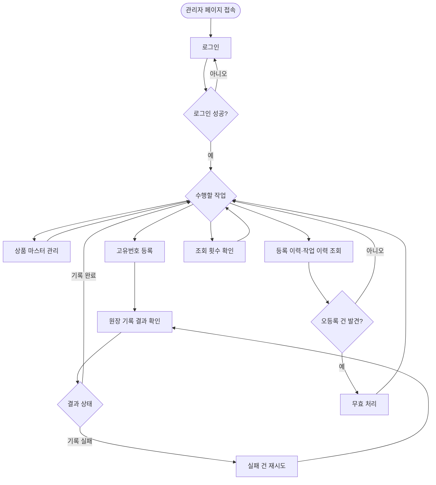
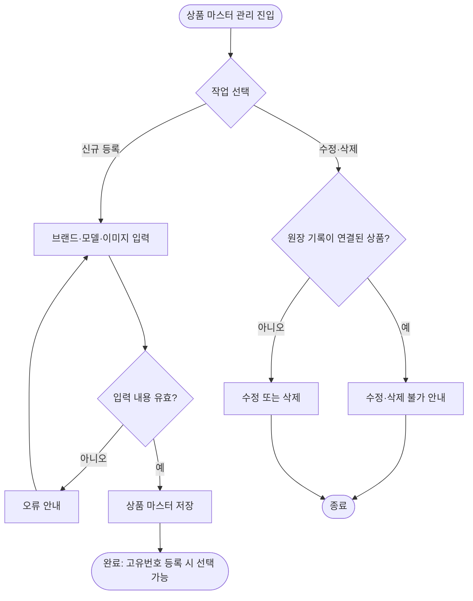
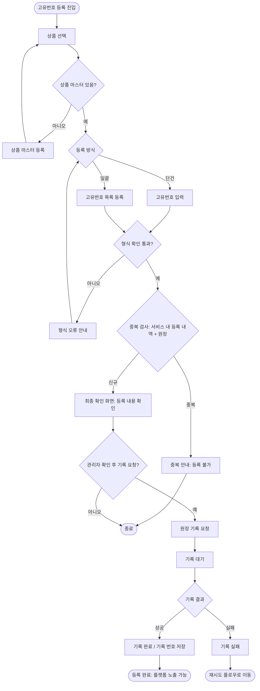
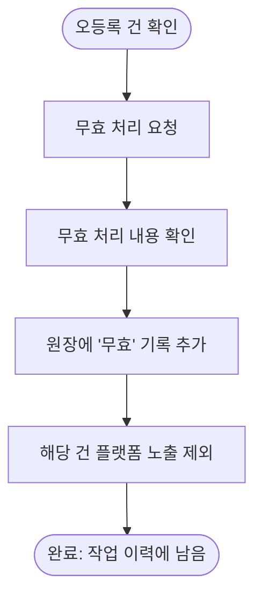
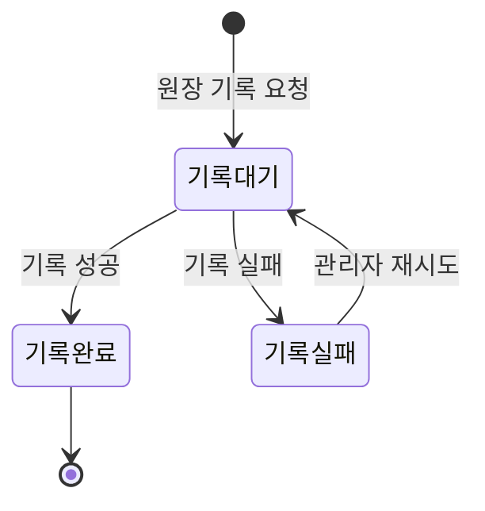
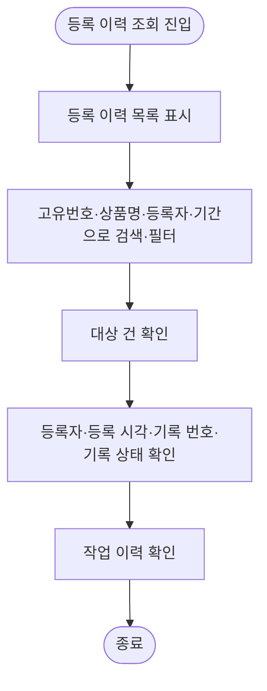
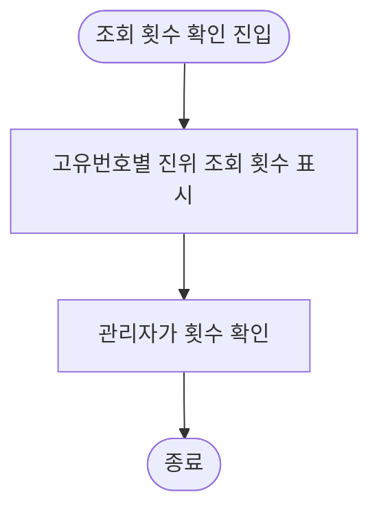

# 관리자 유저 플로우 (ACTOR-001)

`02-유저시나리오.md`의 흐름을 분기와 상태 중심으로 표현한 플로우다. 유저 스토리를 도출하는 근거 자료이며 별도 ID는 부여하지 않는다(ID 스키마 §13). 용어(원장, 기록 번호, 기록 대기·기록 완료·기록 실패 등)는 `08-업무 규칙 및 정책.md`의 용어집를 따른다.

## 1. 전체 플로우

| 구분 | 설명 |
| --- | --- |
| 진입 조건 | 운영 측에서 미리 만들어 준 관리자 계정 |
| 분기 | 로그인 성공 여부, 수행할 작업 선택, 원장 기록 결과, 오등록 건 발견 여부 |
| 반복 | 고유번호 등록 → 기록 결과 확인은 번호마다(일괄 등록은 여러 건을 한 번에) 반복된다 |

## 2. 상품 마스터 관리 플로우

| 단계 | 관리자 행동 | 시스템 처리 |
| --- | --- | --- |
| 1 | 브랜드, 모델, 이미지를 입력한다 | 필수 입력 여부 등 입력 내용을 확인한다 |
| 2 | 저장한다 | 상품 마스터를 저장한다 |
| 3 | — | 이후 고유번호 등록에서 연결할 상품으로 선택할 수 있다 |
| 4 | 저장된 상품 마스터를 수정·삭제한다 | 원장 기록이 연결된(등록 완료된) 상품은 수정·삭제를 허용하지 않고, 연결되지 않은 상품만 허용한다 |

## 3. 고유번호 등록 플로우

| 단계 | 관리자 행동 | 시스템 처리 |
| --- | --- | --- |
| 1 | 등록 근거를 확인한 제품의 상품을 선택한다 | 상품 마스터 목록을 보여 준다. 없으면 상품 마스터를 먼저 등록한다. 등록 근거의 확인은 관리자가 시스템 밖에서 수행한다 |
| 2 | 단건 입력 또는 일괄 등록으로 고유번호를 넣는다 | 형식을 확인한다(최소 검증). 오류이면 사유를 안내하고 원장에 기록을 요청하지 않는다. 형식에 맞는 오입력은 이 단계에서 검출하지 않는다 |
| 3 | — | 서비스 내 등록 내역과 원장에서 중복을 검사한다. 중복이면 등록하지 않는다 |
| 4 | 최종 확인 화면에서 등록 내용을 확인하고 기록을 요청한다 | 관리자가 확인·요청한 건에 대해서만 원장에 기록을 요청하고 기록 대기로 표시한다 |
| 5 | 결과를 확인한다 | 성공 시 기록 완료와 기록 번호를 저장하고, 실패 시 기록 실패로 표시한다 |
| 6 | — | 등록 작업마다 누가 무엇을 했는지 작업 이력으로 남긴다 |

일괄 등록에서 일부 건에 오류가 있을 때의 처리, 파일 형식, 오류 안내 방식은 이 플로우에서 정하지 않는다.

## 4. 실패 건 재시도 플로우

| 단계 | 관리자 행동 | 시스템 처리 |
| --- | --- | --- |
| 1 | 기록 실패 건을 선택한다 | 실패 건 목록을 보여 준다 |
| 2 | 직접 재시도한다 | 원장에 기록을 다시 요청한다. 재시도 횟수는 제한하지 않는다 |
| 3 | 결과를 확인한다 | 성공 시 기록 완료, 실패 시 다시 기록 실패로 표시한다 |

## 5. 오등록 건 무효 처리 플로우

| 단계 | 관리자 행동 | 시스템 처리 |
| --- | --- | --- |
| 1 | 등록 이력에서 오등록 건을 선택하고 무효 처리를 요청한다 | 무효 처리 화면에서 대상 건을 보여 준다 |
| 2 | 내용을 확인하고 진행한다 | 기존 등록 기록은 수정·삭제하지 않고 '무효' 기록을 추가한다 |
| 3 | — | 무효 처리된 건은 플랫폼 노출에서 제외한다 |
| 4 | — | 무효 처리도 누가 무엇을 했는지 작업 이력으로 남긴다 |

무효 처리한 번호의 재등록·복구 가능 여부, 무효 기록이 완료되기 전까지의 노출 상태는 이 플로우에서 정하지 않는다.

## 6. 원장 기록 상태 전이와 등록 유효성

원장 기록 상태(기록 처리의 진행)와 등록 유효성(유효·무효)은 서로 다른 축이다. 기록 상태는 아래 전이를 따르고, 무효 처리는 기록 완료된 등록 건에 '무효' 기록을 추가하는 별도의 업무다.

상태값·의미·플랫폼 노출 여부는 `08-업무 규칙 및 정책.md`의 용어집 §2를 따른다.

| 상태 | 관리자 조치 |
| --- | --- |
| 기록 대기 | 결과 확인 |
| 기록 완료 | 없음. 오등록이면 무효 처리 |
| 기록 실패 | 직접 재시도 |

플랫폼 노출은 기록 완료이면서 무효 처리되지 않은 건에 한한다(POLICY-002, POLICY-010).

## 7. 등록 이력·작업 이력 조회 플로우

| 단계 | 관리자 행동 | 시스템 처리 |
| --- | --- | --- |
| 1 | 등록 이력 화면에 진입한다 | 등록 이력을 보여 준다 |
| 2 | 고유번호, 상품명, 등록자, 기간으로 검색·필터한다 | 조건에 맞는 등록 건을 보여 준다 |
| 3 | 확인할 건을 선택한다 | 등록자, 등록 시각, 기록 번호, 기록 상태를 보여 준다 |
| 4 | 작업 이력을 확인한다 | 등록·무효 처리 등 누가 무엇을 했는지 보여 준다 |

## 8. 조회 횟수 확인 플로우

| 단계 | 관리자 행동 | 시스템 처리 |
| --- | --- | --- |
| 1 | 조회 횟수 화면에 진입한다 | 고유번호별 진위 조회 횟수를 기록해 보여 준다 |
| 2 | 횟수를 확인한다 | 알림·통계 대시보드와 자동 탐지는 제공하지 않는다 |
