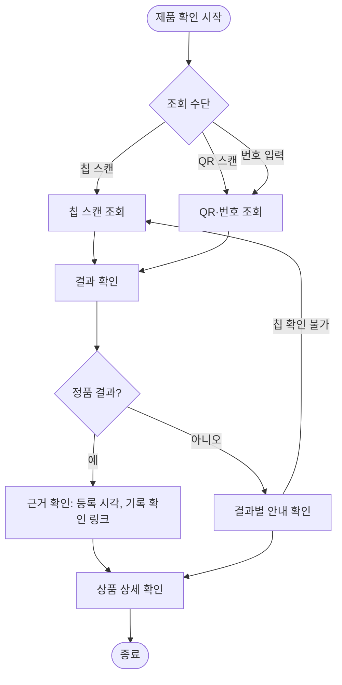
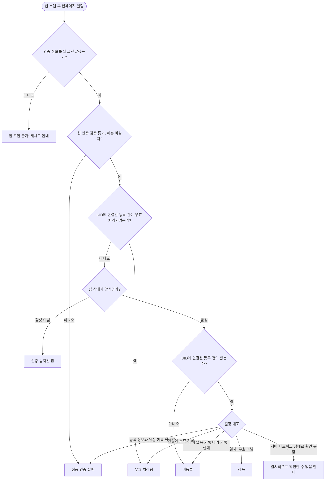
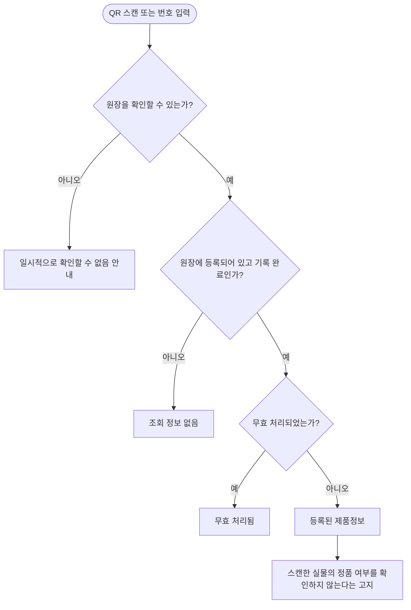

# 소비자 유저 플로우 (ACTOR-002)

`02-유저시나리오.md`의 흐름을 분기와 상태 중심으로 표현한 플로우다. 유저 스토리를 도출하는 근거 자료이며 별도 ID는 부여하지 않는다(`08-업무 규칙 및 정책.md`의 「2. ID 스키마 및 넘버링 규칙」 중 「13. Story ID」). 용어(원장, 기록 번호, 칩 스캔 조회, 진위 조회 등)는 `08-업무 규칙 및 정책.md`의 용어집을 따른다.

## 1. 전체 플로우

| 구분 | 설명 |
| --- | --- |
| 진입 조건 | 회원가입과 로그인 없이 조회한다 |
| 분기 | 조회 수단, 결과 유형 |
| 반복 | 칩 확인 불가일 때 다시 스캔한다 |
| 상품 상세 | 결과에 등록 건이 연결되고 기록 완료되었으며 무효 처리되지 않은 경우에 볼 수 있다 |

## 2. 칩 스캔 조회 플로우

| 결과 | 표시 | '정품'·'가품' 표시 |
| --- | --- | --- |
| 정품 | 등록 시각, 기록 확인 링크 표시 | 정품 |
| 무효 처리됨 | 정품으로 보증할 수 없음 안내 | 해당 없음 |
| 미등록 | 정품 여부를 판단할 수 없음 안내 | 해당 없음 |
| 정품 인증 실패 | 확인하지 못했음을 안내. 가품이라는 뜻이 아님 | 표시하지 않음 |
| 인증 중지된 칩 | 인증이 중지되었음을 안내 | 표시하지 않음 |
| 칩 확인 불가 | 재시도 방법 안내 | 표시하지 않음 |
| (결과 유형 아님) 일시적으로 확인할 수 없음 | 서버·네트워크 장애로 확인하지 못했음과 재시도 방법 안내 | 표시하지 않음 |

판정 순서는 (1) 칩 인증 검증과 훼손 확인, (2) 연결된 등록 건의 무효 처리 여부, (3) 칩 상태, (4) 연결된 등록 건 확인, (5) 원장 대조 순서이며 앞 단계에서 결과가 정해지면 뒤 단계는 적용하지 않는다(PR-031). 동적 인증값을 재사용한 경우도 '정품 인증 실패'로 표시한다(PR-045). 칩 상태 값의 종류와 상태별 결과 매핑(관리자가 설정하는 상태 '훼손' 포함)은 확정하지 않는다(OI-037).

칩을 읽지 못해 웹페이지 자체가 열리지 않는 경우에는 결과 화면이 없으며, 이 플로우에 포함하지 않는다. QR·직접 접속으로 여는 도움말 안내(진위 결과 없음)가 필요한지와 기기·칩별 동작은 칩 실험 후 확정한다(PR-055, OI-027, OI-033).

## 3. QR·번호 조회 플로우

| 결과 | 표시 |
| --- | --- |
| 등록된 제품정보 | 연결된 상품 상세를 보여 주고, 실물의 정품 여부를 확인하지 않는다는 고지와 정품 확인은 칩 스캔으로 한다는 안내를 함께 표시 |
| 무효 처리됨 | 정품으로 보증할 수 없음 안내. 상품 정보는 노출하지 않음 |
| 조회 정보 없음 | 조회할 수 있는 등록 정보가 없음을 안내. 가품을 암시하는 표현을 쓰지 않음 |

이 조회는 '정품'으로 표시하지 않는다.
